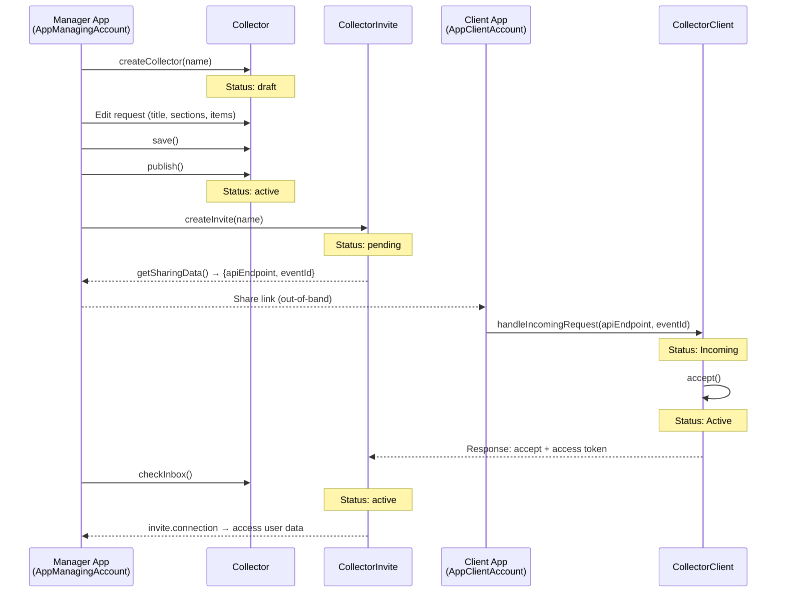
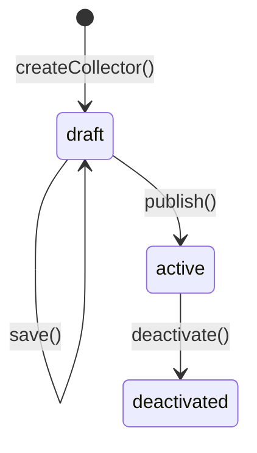
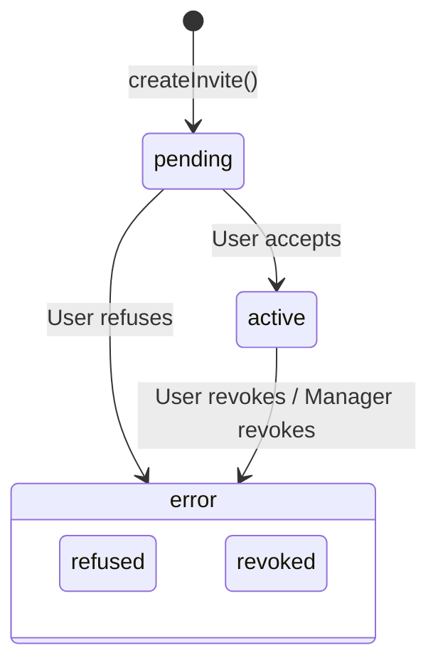
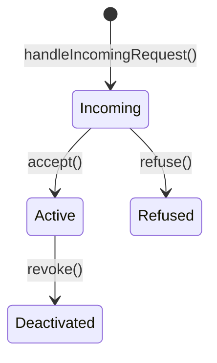

# App Templates — Detailed Guide

App Templates provide a framework for building HDS applications that manage **consent-based data collection and sharing**. They implement the full lifecycle: creating data requests, inviting users, handling accept/refuse/revoke responses, and accessing shared data.

---

## Overview

The framework has two sides:

- **Manager side** — An application (e.g., a doctor's dashboard) that creates data collection requests and sends invites to users
- **Client side** — An application (e.g., a patient's app) that receives requests, lets the user accept/refuse, and shares data



---

## Class hierarchy

```
Application (base)
├── AppManagingAccount
│   ├── Collector
│   │   ├── CollectorRequest
│   │   └── CollectorInvite
│   └── (multiple Collectors)
└── AppClientAccount
    ├── CollectorClient
    │   └── CollectorRequest (read-only)
    └── (multiple CollectorClients)
```

---

## Application (base class)

Both `AppManagingAccount` and `AppClientAccount` extend `Application`.

An Application is defined by:
- A **connection** — `pryv.Connection` instance
- A **baseStreamId** — Root stream ID under the `applications` stream
- An **appName** — Display name

### Instantiation

```javascript
// From API endpoint
const app = await AppManagingAccount.newFromApiEndpoint(
  'my-app',     // baseStreamId
  apiEndpoint,  // API endpoint URL
  'My App'      // display name
);

// From existing connection
const app = await AppManagingAccount.newFromConnection(
  'my-app', connection, 'My App'
);
```

Both factory methods call `init()` automatically, which creates the necessary stream structure.

### Custom settings

Applications can store arbitrary settings as events.

```javascript
// Save settings
await app.setCustomSettings({ theme: 'dark', notifyEmail: true });

// Get settings
const settings = await app.getCustomSettings();

// Update a single key
await app.setCustomSetting('theme', 'light');

// Delete a key
await app.setCustomSetting('notifyEmail', null);
```

### Stream structure

```
applications/
└── {baseStreamId}/          ← App root stream
    └── [settings event]     ← Custom settings stored here
```

---

## AppManagingAccount

Manages data collection campaigns via **Collectors**. Requires master or personal access rights.

### Creating and retrieving Collectors

```javascript
const app = await HDSLib.appTemplates.AppManagingAccount.newFromApiEndpoint(
  'doctor-dashboard', apiEndpoint, 'Doctor Dashboard'
);

// Create a new collector
const collector = await app.createCollector('Patient Intake Form');

// List all collectors
const collectors = await app.getCollectors();

// Get a specific collector
const collector = await app.getCollectorById('collector-stream-id');
```

### AppManagingAccount stream structure

```
applications/
└── {baseStreamId}/
    ├── [settings event]
    ├── {collectorId}/                  ← Collector stream
    │   ├── {collectorId}-internal/     ← Status events
    │   ├── {collectorId}-public/       ← Published request
    │   ├── {collectorId}-pending/      ← Pending invites
    │   ├── {collectorId}-inbox/        ← Incoming responses
    │   ├── {collectorId}-active/       ← Accepted invites
    │   ├── {collectorId}-error/        ← Refused/revoked invites
    │   └── {collectorId}-archive/      ← Archived invites
    └── {collectorId-2}/
        └── ...
```

---

## Collector

A Collector represents a single data collection request with its set of invites. It has a lifecycle: `draft` → `active` → `deactivated`.

### Lifecycle



### Properties

| Property | Type | Description |
|----------|------|-------------|
| `id` / `streamId` | `string` | Unique identifier |
| `name` | `string` | Display name |
| `statusCode` | `string` | `'draft'`, `'active'`, or `'deactivated'` |
| `request` | `CollectorRequest` | Mutable request payload |

### Editing and publishing

```javascript
// Create collector (status: draft)
const collector = await app.createCollector('Blood Work Request');

// Edit the request
collector.request.title = { en: 'Blood Work Request', fr: 'Demande de bilan sanguin' };
collector.request.description = { en: 'Please share your recent blood work results.' };
collector.request.requesterName = 'Dr. Smith';

// Add sections with items
const section = collector.request.createSection('vitals', 'permanent');
section.setName({ en: 'Vital Signs' });
section.addItemKeys(['body-weight', 'body-height']);

// Save (while in draft)
await collector.save();

// Publish (draft → active, irreversible)
await collector.publish();
```

### Managing invites

```javascript
// Create an invite (collector must be active)
const invite = await collector.createInvite('Alice Patient', {
  customData: { patientId: '12345' }
});

// Get sharing data to send to the user
const sharingData = invite.getSharingData();
// { apiEndpoint: "https://...", eventId: "evt-id" }

// List all invites
const invites = await collector.getInvites();

// Check for new responses (accept/refuse/revoke)
const updatedInvites = await collector.checkInbox();

// Revoke an invite
await collector.revokeInvite(invite);
```

### Event types used

| Event type | Stream | Purpose |
|-----------|--------|---------|
| `status/collector-v1` | `-internal` | Collector status + request data |
| `request/collector-v1` | `-public` | Published request (readable by invitees) |
| `invite/collector-v1` | `-pending` | Pending invite events |
| `response/collector-v1` | `-inbox` | Accept/refuse/revoke responses from users |

---

## CollectorRequest

Mutable data structure holding the request payload: title, description, sections, permissions, and features.

### Properties (getters/setters)

| Property | Type | Description |
|----------|------|-------------|
| `version` | `number` | Always `1` (read-only) |
| `title` | `localizableText` | Request title |
| `description` | `localizableText` | Request description |
| `consent` | `localizableText` | Consent text shown to users |
| `requesterName` | `string` | Name of the requester |
| `appId` | `string` | Application identifier |
| `appUrl` | `string` | Application URL |
| `appCustomData` | `any` | Arbitrary app metadata |
| `permissions` | `PermissionItem[]` | Auto-generated permissions (read-only) |
| `permissionsExtra` | `PermissionItem[]` | Extra non-item permissions (read-only) |
| `features` | `object` | Optional features (e.g., chat) |
| `sections` | `CollectorRequestSection[]` | Form sections (read-only array) |
| `content` | `object` | Full serializable payload |

### Sections

Sections organize the data items being requested. Each section has a type:
- **`permanent`** — Data collected once (e.g., profile information)
- **`recurring`** — Data collected repeatedly (e.g., daily measurements)

```javascript
// Create sections
const profile = collector.request.createSection('profile-data', 'permanent');
profile.setName({ en: 'Profile', fr: 'Profil' });
profile.addItemKeys(['profile-name', 'profile-date-of-birth']);

const daily = collector.request.createSection('daily-measures', 'recurring');
daily.setName({ en: 'Daily Measurements' });
daily.addItemKeys(['body-weight']);

// Customize an item within a section
daily.setItemCustomization('body-weight', {
  repeatable: 'once-per-day'
});

// Reorder items within a section
daily.moveItemKey('body-weight', 0);

// Remove an item
daily.removeItemKey('body-weight');

// Reorder sections
collector.request.moveSection('daily-measures', 0);

// Remove a section
collector.request.removeSection('profile-data');

// Get section by key
const sec = collector.request.getSectionByKey('daily-measures');
```

### CollectorRequestSection

| Property/Method | Description |
|----------------|-------------|
| `key` | Section identifier |
| `type` | `'permanent'` or `'recurring'` |
| `name` | Localized section name |
| `itemKeys` | Array of item keys |
| `itemCustomizations` | Per-item customization map |
| `addItemKey(key)` | Add an item |
| `addItemKeys(keys)` | Add multiple items |
| `removeItemKey(key)` | Remove an item |
| `moveItemKey(key, toIndex)` | Reorder an item |
| `setName(localizableText)` | Set section name |
| `setNameLocal(lang, name)` | Set name for one locale |
| `setItemCustomization(key, data)` | Set custom data for an item |
| `getItemCustomization(key)` | Get custom data for an item |
| `getData()` | Serializable section object |

### Permissions

Permissions are auto-generated from section items. They define what stream access the requester needs.

```javascript
// Auto-generate from all sections
collector.request.buildPermissions();

// Add extra permissions not linked to items
collector.request.addPermissionExtra({
  streamId: 'app-data',
  defaultName: 'App Data',
  level: 'manage'
});

// Manual permission management
collector.request.addPermission('body', 'Body', 'read');
collector.request.resetPermissions();
```

### Chat feature

Enable real-time messaging between requester and user.

```javascript
collector.request.addChatFeature({ type: 'user' });

// Check if enabled
collector.request.hasChatFeature; // true
```

### Data structure

```
CollectorRequest
|
|-- title: localizableText
|-- description: localizableText
|-- consent: localizableText
|-- requesterName: string
|-- appId: string
|
|-- sections[]
|   |-- Section (permanent)
|   |   |-- key: "profile-data"
|   |   |-- name: { en: "Profile" }
|   |   |-- itemKeys: ["profile-name", "profile-dob"]
|   |   +-- itemCustomizations: { ... }
|   |
|   +-- Section (recurring)
|       |-- key: "daily-measures"
|       |-- name: { en: "Daily" }
|       |-- itemKeys: ["body-weight"]
|       +-- itemCustomizations: { ... }
|
|-- permissions[]  (auto-generated from sections)
|   |-- { streamId: "profile", level: "read", defaultName: "Profile" }
|   +-- { streamId: "body-weight", level: "read", defaultName: "Weight" }
|
|-- permissionsExtra[]  (manually added)
|   +-- { streamId: "app-data", level: "manage" }
|
+-- features
    +-- chat: { type: "user" }
```

---

## CollectorInvite

Represents a one-to-one relationship between a Collector and an end user. Created by the Collector and tracked through status changes.

### Invite lifecycle



### Properties

| Property | Type | Description |
|----------|------|-------------|
| `key` | `string` | Unique identifier (event ID) |
| `status` | `string` | `'pending'`, `'active'`, or `'error'` |
| `errorType` | `string` | `'refused'` or `'revoked'` (when status is error) |
| `displayName` | `string` | User-facing name set at creation |
| `dateCreation` | `Date` | When the invite was created |
| `apiEndpoint` | `string` | Connection endpoint (only when active) |
| `connection` | `pryv.Connection` | Connection to user's account (only when active) |

### Methods

```javascript
// Get data to share with the user (pending only)
const { apiEndpoint, eventId } = invite.getSharingData();

// Check if connection is still valid (active only)
const accessInfo = await invite.checkAndGetAccessInfo();
// Returns null if revoked

// Revoke the invite
await invite.revoke();
```

### Chat (when enabled)

```javascript
// Check if chat is available
invite.hasChat; // true/false

// Post a message
await invite.chatPost('Hello, how are you feeling today?');

// Get message source info
const info = invite.chatEventInfos(event);
// { source: 'me' | 'user' | 'unknown' }

// Chat settings
invite.chatSettings;
// { type: 'user', streamRead: '...', streamWrite: '...' }
```

---

## AppClientAccount

The counterpart of `AppManagingAccount` for end-user applications. Handles incoming data requests and lets users accept, refuse, or revoke them.

### Setup

```javascript
const clientApp = await HDSLib.appTemplates.AppClientAccount.newFromApiEndpoint(
  'patient-app', apiEndpoint, 'Patient App'
);
```

Requires master or personal access rights.

### Handling incoming requests

When the user receives a sharing link (apiEndpoint + eventId) from a Manager app:

```javascript
const collectorClient = await clientApp.handleIncomingRequest(apiEndpoint, eventId);
// Returns a CollectorClient instance (status: Incoming)
```

### Listing requests

```javascript
// All collector clients
const clients = await clientApp.getCollectorClients();

// By key
const client = await clientApp.getCollectorClientByKey('username:collector-name');
```

---

## CollectorClient

Represents the user's side of a data collection relationship. Handles accept/refuse/revoke actions and provides access to the request data.

### CollectorClient lifecycle



### Properties

| Property | Type | Description |
|----------|------|-------------|
| `key` | `string` | Identifier (`username:collectorName`) |
| `status` | `string` | `'Incoming'`, `'Active'`, `'Deactivated'`, `'Refused'` |
| `requesterUsername` | `string` | Requester's HDS username |
| `requesterApiEndpoint` | `string` | Connection URL to requester |
| `requesterConnection` | `pryv.Connection` | Lazy-loaded connection to requester |
| `requestData` | `object` | Full request content from the invite |
| `hasChatFeature` | `boolean` | Whether chat is enabled |

### Accept / Refuse / Revoke

```javascript
// Accept — creates access grant and sends accept response
const result = await collectorClient.accept();
// result.accessData — the created access
// result.requesterEvent — the response event sent to requester

// Refuse — sends refuse response (no access granted)
await collectorClient.refuse();

// Revoke — deletes access grant and sends revoke response
await collectorClient.revoke();
```

### Reading request data

```javascript
// Get the sections from the request
const sections = collectorClient.getSections();
// Array of CollectorSectionInterface:
// [
//   { key: 'vitals', type: 'permanent', name: { en: 'Vital Signs' }, itemKeys: [...] },
//   { key: 'daily', type: 'recurring', name: { en: 'Daily' }, itemKeys: [...] }
// ]

// Full request data
const data = collectorClient.requestData;
```

### Chat (when enabled)

```javascript
// Check if chat is available
collectorClient.hasChatFeature; // true/false

// Chat stream names
collectorClient.chatSettings;
// { chatStreamIncoming: 'chat-requester-in', chatStreamMain: 'chat-requester' }

// Post a message (requires user's HDS connection)
await collectorClient.chatPost(hdsConnection, 'Thank you for the request.');

// Get message source info
const info = collectorClient.chatEventInfos(event);
// { source: 'me' | 'requester' | 'unknown' }
```

---

## Complete flow — Step by step

### 1. Manager creates a data request

```javascript
// Setup
const managerApp = await AppManagingAccount.newFromApiEndpoint(
  'doctor-app', doctorApiEndpoint, 'Doctor App'
);

// Create collector
const collector = await managerApp.createCollector('Intake Form');

// Define request
collector.request.title = { en: 'Patient Intake Form' };
collector.request.description = { en: 'Please share your health profile.' };
collector.request.requesterName = 'Dr. Smith';

const section = collector.request.createSection('profile', 'permanent');
section.setName({ en: 'Profile Information' });
section.addItemKeys(['profile-name', 'profile-date-of-birth', 'body-weight']);

collector.request.buildPermissions();
collector.request.addChatFeature();

await collector.save();
await collector.publish();
```

### 2. Manager sends invites

```javascript
const invite = await collector.createInvite('Alice');
const sharingData = invite.getSharingData();
// Send sharingData.apiEndpoint and sharingData.eventId to Alice
// (via QR code, email, messaging, etc.)
```

### 3. Client receives and accepts

```javascript
const clientApp = await AppClientAccount.newFromApiEndpoint(
  'patient-app', aliceApiEndpoint, 'Patient App'
);

// Handle the incoming request
const cc = await clientApp.handleIncomingRequest(
  sharingData.apiEndpoint,
  sharingData.eventId
);

// Review the request
console.log(cc.requestData.title);    // { en: 'Patient Intake Form' }
console.log(cc.requesterUsername);     // 'dr-smith'
console.log(cc.getSections());        // Section details

// Accept
await cc.accept();
```

### 4. Manager reads responses

```javascript
// Poll for responses
const updated = await collector.checkInbox();

for (const invite of updated) {
  if (invite.status === 'active') {
    // Access the user's data
    const conn = invite.connection;
    const events = await conn.api([{
      method: 'events.get',
      params: { streams: ['body-weight'], limit: 10 }
    }]);
  }
}
```

### 5. Revocation (either side)

```javascript
// User revokes
await collectorClient.revoke();

// OR Manager revokes
await collector.revokeInvite(invite);

// Next checkInbox() will pick up the change
```

---

## Stream structure — Full picture

Collector stream structure within a Manager account:

```
applications/
+-- {baseStreamId}/                          (App root stream)
    |
    +-- {collectorId}/                       (Collector stream)
        |
        |-- {collectorId}-internal/          status/collector-v1
        |   State tracking: draft / active / deactivated
        |   Stores request data alongside status
        |
        |-- {collectorId}-public/            request/collector-v1
        |   Published request (shared with invitees)
        |
        |-- {collectorId}-pending/           invite/collector-v1
        |   Invites awaiting user response
        |
        |-- {collectorId}-inbox/             response/collector-v1
        |   Incoming responses: accept / refuse / revoke
        |
        |-- {collectorId}-active/
        |   Accepted invites (moved from pending)
        |
        |-- {collectorId}-error/
        |   Refused or revoked invites
        |
        +-- {collectorId}-archive/
            Archived invites
```

### Access model

There is **one shared access token per Collector** (not per invitee). When a Collector is published, `sharingApiEndpoint()` creates a shared access named `a-{collectorStreamId}` with these permissions:

| Stream | Level | Purpose |
|--------|-------|---------|
| `*-public` | `read` | Anyone with the link can read the published request |
| `*-inbox` | `create-only` | Anyone with the link can post a response (accept/refuse/revoke) |

All other sub-streams (`-internal`, `-pending`, `-active`, `-error`, `-archive`) are **only accessible to the Manager's own connection**. Invitees cannot see each other's invites or responses.

The `selfRevoke` and `selfAudit` features are explicitly **forbidden** on this shared access.

```
Manager account (full access)
|
|-- *-internal     Manager only    Status + request drafts
|-- *-public       Shared: read    Published request (visible to all invitees)
|-- *-pending      Manager only    Invite events (one per invitee)
|-- *-inbox        Shared: create  Responses land here (write-only for invitees)
|-- *-active       Manager only    Accepted invites (moved from pending)
|-- *-error        Manager only    Refused/revoked invites
+-- *-archive      Manager only    Processed inbox responses
```

Individual invites are **events** (not streams). Each invite event lives in `-pending` and gets moved to `-active` or `-error` based on the user's response. The invitee never sees this event directly — they only interact through the shared `-public` (read) and `-inbox` (create-only) streams.

**Invite flow between streams:**

```
pending ──accept──> active ──revoke──> error
   |                                     ^
   +────────────refuse─────────────------+
```

---

## Interfaces

### CollectorSectionInterface

```typescript
interface CollectorSectionInterface {
  key: string;
  type: 'recurring' | 'permanent';
  name: localizableText;
  itemKeys: string[];
  itemCustomizations?: Record<string, Record<string, unknown>>;
}
```

### RequestSectionType

```typescript
type RequestSectionType = 'recurring' | 'permanent';
```
