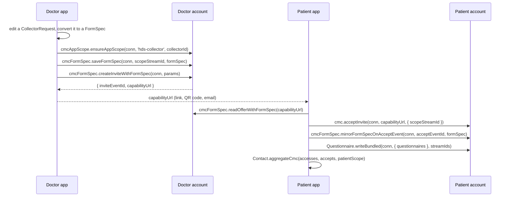

# App Templates: Detailed Guide

> Publishing the data scope of your own app (`hds-dataset.json`)? See [Data-set templates](./dataset-templates.md).

`appTemplates` holds the building blocks HDS apps use for **consent-based data collection**: a requester (doctor, researcher, bridge) describes the data it wants, the account owner (patient) accepts, and both sides then work with the resulting relationship.

Since hds-lib 1.0.0 the consent exchange itself runs on **CMC** (the consent-management plugin of the Pryv core, client SDK `@pryv/cmc`, re-exported as `cmc`). This library adds the HDS layer on top of it:

- `CollectorRequest`: editor state for a data request (texts, sections, permissions, features).
- `cmcFormSpec`: the **FormSpec**, the stored form of a data request, and the invite helpers that carry it.
- `Contact`: the patient-side view of accepted CMC relationships, grouped by counterparty.
- `Questionnaire`: questionnaires bundled into a request or sent on their own.
- `AppManagingAccount` / `AppClientAccount`: thin `Application` wrappers (connection, app stream, custom settings).
- `loadTemplate` / `loadTemplateFromUrl`: the AppTemplate JSON format.

> **Removed in 1.0.0:** `Collector`, `CollectorInvite`, `CollectorClient`, `AppManagingAccount.createCollector` / `getCollectors` / `getCollectorById`, `AppClientAccount.handleIncomingRequest` / `getCollectorClients`, and the `applications/<app>/<collectorId>-*` stream layout with its `*/collector-v1` event types. See the 1.0.0 entry of the [CHANGELOG](https://github.com/healthdatasafe/hds-lib-js/blob/main/CHANGELOG.md) for the migration notes.

---

## Overview


```mermaid
sequenceDiagram
    participant D as Doctor app
    participant DC as Doctor account
    participant P as Patient app
    participant PC as Patient account

    D->>D: edit a CollectorRequest, convert it to a FormSpec
    D->>DC: cmcAppScope.ensureAppScope(conn, 'hds-collector', collectorId)
    D->>DC: cmcFormSpec.saveFormSpec(conn, scopeStreamId, formSpec)
    D->>DC: cmcFormSpec.createInviteWithFormSpec(conn, params)
    DC-->>D: { inviteEventId, capabilityUrl }
    D-->>P: capabilityUrl (link, QR code, email)
    P->>DC: cmcFormSpec.readOfferWithFormSpec(capabilityUrl)
    P->>PC: cmc.acceptInvite(conn, capabilityUrl, { scopeStreamId })
    P->>PC: cmcFormSpec.mirrorFormSpecOnAcceptEvent(conn, acceptEventId, formSpec)
    P->>PC: Questionnaire.writeBundled(conn, { questionnaires }, streamIds)
    P->>P: Contact.aggregateCmc(accesses, accepts, patientScope)
```

The doctor side reads the patient data through the data-grant access the CMC plugin creates on accept. Relationship lifecycle (refuse, revoke, scope updates, chat, system messages) is handled by `cmc.*` directly; see the `@pryv/cmc` README.

---

## Application (base class)

`AppManagingAccount` and `AppClientAccount` both extend `Application`. An Application is defined by:

- `connection`: a `pryv.Connection`
- `baseStreamId`: the app's own stream, created as a child of the `applications` root stream
- `appName`: display name (also the name of the created stream)

### Instantiation

```javascript
import { appTemplates } from 'hds-lib';

// From an API endpoint
const app = await appTemplates.AppClientAccount.newFromApiEndpoint(
  'my-app',      // baseStreamId (at least 2 characters)
  apiEndpoint,
  'My App'       // appName
);

// From an existing connection
const app2 = await appTemplates.AppClientAccount.newFromConnection('my-app', connection, 'My App');
```

Both factories accept an optional fourth argument, `features`: `{ streamsAutoCreate?: boolean }` (default `true`, attaches a `toolkit.StreamsAutoCreate` instance to the connection). Both call `init()`, which checks the access and creates `applications` and `applications/<baseStreamId>` when missing.

Access requirements checked by `init()`:

- a `personal` access, or
- an `app` access with `manage` on `*`, or with `manage` on `baseStreamId` (then the app streams must already exist).

A custom `Application` subclass can require the `*` / `manage` access by returning `mustBeMaster: true` from
`appSettings`. `AppManagingAccount` and `AppClientAccount` do not: their apps log in with scoped accesses.

`appName` is required unless the subclass takes it from the access info. `AppManagingAccount` does (`appNameFromAccessInfo`), so its `appName` argument is optional and is replaced by the access name.

### Custom settings

Arbitrary app settings are stored as a single `settings/any` event in `baseStreamId`.

```javascript
await app.setCustomSettings({ theme: 'dark', notifyEmail: true }); // replace all
const settings = await app.getCustomSettings();                    // cached; pass true to refetch
await app.setCustomSetting('theme', 'light');                      // update one key
await app.setCustomSetting('notifyEmail', null);                   // delete one key
```

### Stream data

```javascript
app.streamData;              // the baseStreamId stream (with children), loaded by init()
await app.loadStreamData();  // refetch it
```

### Stream structure

```
applications/
└── {baseStreamId}/          app root stream
    └── [settings/any event] custom settings
```

### AppManagingAccount and AppClientAccount

Since 1.0.0 both classes are the `Application` surface only; they no longer manage forms or relationships.

| Class | Side | Differences from `Application` |
|-------|------|--------------------------------|
| `AppManagingAccount` | doctor / researcher | `appName` taken from the access info |
| `AppClientAccount` | patient | `appName` required |

Typical use is as the target of `HDSSettings.hookToApplication(app)` (see [Settings](./settings.md)). Form storage goes through `cmcFormSpec`, invites and relationships through `cmc`, and the patient's relationship list through `Contact.aggregateCmc`.

---

## CollectorRequest

`CollectorRequest` is the in-memory editor state of a data request. It is used by FormBuilder UIs (`hds-forms-js`), converted to a FormSpec for storage and invites, and rebuilt from a FormSpec for editing. It does no I/O.

### Creating

```javascript
const { CollectorRequest } = appTemplates;

const request = new CollectorRequest({});          // empty
const loaded = new CollectorRequest(content);      // from a serialized `content`
request.setContent(otherContent);                  // merge more content in
```

`setContent` reads the keys described below and validates them. A `version` of `0` is converted to version `1`; any other version than `1` throws. Keys it does not know are kept and returned unchanged by `request.content`. An unknown key inside `features` throws.

### Properties

| Property | Type | Description |
|----------|------|-------------|
| `version` | `number` | Always `1` (read-only) |
| `title` | `localizableText` | Request title |
| `description` | `localizableText` | Request description |
| `consent` | `localizableText` | Consent text shown to the patient |
| `requesterName` | `string` | Name of the requester |
| `appId` | `string` | Application identifier |
| `appUrl` | `string` | Application URL |
| `appCustomData` | `any` | Arbitrary app metadata (serialized as `app.data`) |
| `permissions` | `PermissionItem[]` | Permissions (read-only array, see [Permissions](#permissions)) |
| `permissionsExtra` | `PermissionItemLight[]` | Extra permissions not linked to items (read-only array) |
| `features` | `{ chat?: { type: 'user' \| 'usernames' } }` | Optional features |
| `hasChatFeature` | `boolean` | `true` when `features.chat` is set |
| `sections` | `CollectorRequestSection[]` | Form sections (read-only array) |
| `sectionsData` | `object[]` | Serialized sections |
| `existingStreamRefs` | `ExistingStreamRef[]` | Access asks on pre-existing streams |
| `customFields` | `CustomFieldDeclaration[]` | Template-private streams to provision |
| `questionnaires` | `QuestionnaireRequestContent[]` | Bundled questionnaires |
| `content` | `object` | Full serializable payload |

`title`, `description`, `consent` and section names accept either a `localizableText` object or a plain string. A plain string is stored as the English text (`'Weight'` becomes `{ en: 'Weight' }`), matching the AppTemplate schema.

### Sections

Sections group the requested data items. Each section has a type:

- **`permanent`**: data entered once (profile-like)
- **`recurring`**: data entered repeatedly (daily measurements, ...)

```javascript
const profile = request.createSection('profile-data', 'permanent');
profile.setName({ en: 'Profile', fr: 'Profil' });
profile.addItemKeys(['profile-name', 'profile-date-of-birth']);

const daily = request.createSection('daily-measures', 'recurring');
daily.setName('Daily measurements');
daily.addItemKeys(['body-weight']);
daily.setItemCustomization('body-weight', { repeatable: 'P1D' });

daily.moveItemKey('body-weight', 0);
request.moveSection('daily-measures', 0);
request.getSectionByKey('daily-measures');
request.removeSection('profile-data');
```

`createSection` throws if the key already exists. `addItemKey` throws if the item key is unknown to the loaded HDS model, and ignores duplicates.

#### CollectorRequestSection

| Property / method | Description |
|-------------------|-------------|
| `key` | Section identifier |
| `type` | `'permanent'` or `'recurring'` |
| `name` | Localized section name |
| `itemKeys` | Item keys, in display order |
| `itemCustomizations` | Per-item customization map |
| `customFieldKeys` | Keys of `request.customFields[]` entries shown in this section |
| `addItemKey(key)` / `addItemKeys(keys)` | Add items (validated against the model) |
| `removeItemKey(key)` | Remove an item (throws if absent) |
| `moveItemKey(key, toIndex)` | Reorder an item |
| `setName(localizableText \| string)` | Set the section name |
| `setNameLocal(lang, name)` | Set the name for one language |
| `setItemCustomization(key, data)` / `getItemCustomization(key)` | Per-item customization |
| `setCustomFieldKeys(keys)` / `addCustomFieldKey(key)` | Reference custom fields |
| `getData()` | Serializable section object |

### Permissions

```javascript
// Rebuild `permissions` from every section's itemKeys plus `permissionsExtra`
request.buildPermissions();

// Extra permission not linked to an item (defaultName and level are optional)
request.addPermissionExtra({ streamId: 'profile', level: 'read' });

// Manual management
request.addPermission('body', 'Body', 'read');
request.addPermissions([{ streamId: 'body', defaultName: 'Body', level: 'read' }]);
request.resetPermissions();
```

`buildPermissions()` uses `getHDSModel().authorizations.forItemKeys(itemKeys, { preRequest: permissionsExtra })`: one `read` permission per item stream, the extras merged in (a missing `defaultName` is taken from the model streams, a missing `level` defaults to `read`), and a permission dropped when a parent stream already grants the same or a higher level. `permissionsExtra` itself is not modified.

`buildPermissions()` does not look at `existingStreamRefs` or `customFields`. Wherever permissions are rebuilt from item keys, re-add the `read` grant on `app-private` refs with `appTemplates.withAppPrivatePermissions(request.permissions, request.existingStreamRefs)` (see [Data-set templates](./dataset-templates.md)).

### Chat feature

```javascript
request.addChatFeature();                       // { type: 'user' }
request.addChatFeature({ type: 'usernames' });
request.addChatFeature(true);                   // FormSpec / AppTemplate shape: same as { type: 'user' }
request.addChatFeature(false);                  // removes chat
request.hasChatFeature;                         // boolean
```

`setContent` accepts the same values in `features.chat`, so a FormSpec with `features: { chat: true }` or `{ chat: false }` loads as is. `request.content.features.chat` is always serialized as the object form (`{ type: 'user' }`) or absent.

### Existing stream refs and custom fields

```javascript
// Access on a stream that already exists on the patient account (not provisioned)
request.addExistingStreamRef({
  streamId: 'cycle-app-notes',
  permissions: ['read'],          // 'read' | 'contribute' | 'manage', non-empty
  purpose: 'app-private',         // optional
  label: { en: 'Daily notes' }    // optional
});

// A template-private stream provisioned at acceptance
request.addCustomField({
  streamId: 'my-template-mood-note',   // must start with `${def.templateId}-`
  eventType: 'note/txt',               // note/txt | note/html | count/generic | date/iso-8601 | activity/plain
  def: { version: 'v1', templateId: 'my-template', key: 'mood-note', label: { en: 'Mood note' } }
});
request.getSectionByKey('daily-measures').addCustomFieldKey('mood-note');
```

The full custom-field rules (`clientData.hdsCustomField`, sandbox prefix, the three stream-reference modes) are in [`ts/appTemplates/CUSTOM-FIELDS-AND-SYSTEM.md`](https://github.com/healthdatasafe/hds-lib-js/blob/main/ts/appTemplates/CUSTOM-FIELDS-AND-SYSTEM.md).

### Questionnaires

A request can bundle one or more [questionnaires](#questionnaire) to deliver at first contact.

```javascript
request.addQuestionnaire(questionnaire);       // a Questionnaire instance or raw request content
request.questionnaires;                        // QuestionnaireRequestContent[]
request.getQuestionnaire(0);                   // a fresh Questionnaire over entry 0, or null
request.removeQuestionnaire(0);                // true if it existed

// Do the request's permissions cover every item the questionnaire asks about?
const report = request.checkQuestionnaireCoverage(questionnaire);   // read-only
// report: { ok, perQuestion[], unknownItems[], proposedPermissions[] }

// Same, and add the missing permissions to the request
request.applyQuestionnaireCoverage(questionnaire);
```

The standalone helper is `appTemplates.checkQuestionnaireCoverage(questionnaire, request)`; `request` can be any object with a `permissions` array.

### Content

`request.content` returns:

```
{
  version: 1,
  title, consent, description,
  requester: { name },
  features: { chat? },
  permissionsExtra: [...],
  permissions: [...],
  app: { id, url, data },
  sections: [ { key, type, name, itemKeys, itemCustomizations?, customFieldKeys? } ],
  existingStreamRefs?: [...],      only when non-empty
  customFields?: [...],            only when non-empty
  questionnaires?: [...],          only when non-empty
  ...unknown keys given to setContent
}
```

### CollectorRequest and FormSpec

The FormSpec (below) is the stored and shared form of a request. The two shapes overlap but are not identical:

| CollectorRequest | FormSpec |
|------------------|----------|
| `features.chat: { type }` | `features.chat: boolean` |
| `app.data` (`appCustomData`) | `appCustomData` |
| `requester`, `app.id`, `app.url`, `permissionsExtra` | not stored |
| `questionnaires` | not in the `FormSpec` type, carried as an extra key on the snapshot |

`new CollectorRequest(formSpec)` loads a FormSpec (the boolean `features.chat` and the plain-string texts are accepted); FormSpec-only keys such as `appCustomData`, `source` and `openLink` are kept as extra content, not mapped. To go the other way, build the FormSpec explicitly:

```javascript
const formSpec = {
  version: 1,
  title: request.title,
  description: request.description,
  consent: request.consent,
  permissions: request.permissions,
  sections: request.sectionsData,
  features: { chat: request.hasChatFeature },
  ...(request.customFields.length > 0 ? { customFields: request.customFields } : {}),
  ...(request.existingStreamRefs.length > 0 ? { existingStreamRefs: request.existingStreamRefs } : {})
};
```

---

## Questionnaire

A `Questionnaire` is a reusable set of questions with a temporal scope. It serializes to the content of a `questionnaire/request-v1` event; answers are `questionnaire/answer-v1` events. Storage shape: [`data-model/documentation/QUESTIONNAIRE.md`](https://github.com/healthdatasafe/data-model/blob/main/documentation/QUESTIONNAIRE.md).

```javascript
const { Questionnaire } = appTemplates;

const q = new Questionnaire({ title: { en: 'Intake' } });
q.addQuestion('weight', {
  label: { en: 'Your weight' },
  itemRef: 'body-weight',
  scope: { type: 'latest', withinDays: 30 }   // or { type: 'ever' } / { type: 'window', withinDays }
});
q.questionKeys;                 // ['weight']
q.getQuestion('weight');
q.removeQuestion('weight');
q.toRequestEventContent();      // throws when there is no question

Questionnaire.fromRequestEvent(event);                            // load from a request event
Questionnaire.makeRequestEvent(content, streamIds, timeSeconds);  // ready-to-write events.create params
await Questionnaire.writeBundled(connection, { questionnaires }, streamIds); // one events.create per entry
Questionnaire.buildAnswerEvent(requestEventId, answers, knownKeys); // { content, clientData: { related } }
```

Question keys must match `[a-zA-Z0-9_-]+`. Answer statuses are `answered` (with non-empty `references`), `no`, `unknown` and `declined` (optional `reason`).

---

## CMC FormSpec flow

The helpers below are exported as `cmcFormSpec`, `cmcAppScope` and `cmcConstants` (`import { cmcFormSpec } from 'hds-lib'`). The CMC SDK itself is exported as `cmc`.

### FormSpec

```typescript
interface FormSpec {
  version: 1;
  title: localizableText;
  description: localizableText;
  consent?: localizableText;
  permissions: Permission[];             // may be empty for a chat-only data set
  sections: AppTemplateSection[];
  features?: { chat?: boolean };
  customFields?: CustomFieldDeclaration[];
  existingStreamRefs?: ExistingStreamRef[];
  appCustomData?: { requiredBridges?: string[]; [key: string]: any };
  source?: FormSpecSource;               // imported from a data-set template URL
  openLink?: FormSpecOpenLink;           // the data set's permanent invite
}
```

Where a FormSpec lives:

- **Doctor side:** one `hds-form-spec/v1` event per data set, on the scope stream `:_cmc:apps:hds-collector:<collectorId>`.
- **Per invite:** a snapshot in `content.hdsFormSpec` of the doctor's `consent/request-cmc` trigger event, copied by the CMC plugin to the offer when the capability is minted.
- **Patient side:** mirrored onto the patient's own `consent/accept-cmc` event after accept.

### Doctor side

```javascript
import { cmc, cmcFormSpec, cmcAppScope, cmcConstants } from 'hds-lib';
const { CMC_APP_CODES } = cmcConstants;

// 1. Scope stream for the data set (creates the sub-scope if missing)
const collectorId = 'my-data-set';
const scopeStreamId = await cmcAppScope.ensureAppScope(connection, CMC_APP_CODES.COLLECTOR, collectorId);

// 2. Store the FormSpec (create or update the one hds-form-spec/v1 event)
const issues = cmcFormSpec.validateFormSpecItemKeys(formSpec); // [] when every item key resolves
await cmcFormSpec.saveFormSpec(connection, scopeStreamId, formSpec);

// 3. Read FormSpecs back
const records = await cmcFormSpec.listFormSpecs(connection);            // FormSpecRecord[]
const record = await cmcFormSpec.getFormSpecById(connection, collectorId); // { collectorId, formSpec, event } | null

// 4. Invite a patient, with the FormSpec snapshot on the offer
const { inviteEventId, capabilityUrl } = await cmcFormSpec.createInviteWithFormSpec(connection, {
  appCode: CMC_APP_CODES.COLLECTOR,
  scopeStreamId,
  displayName: 'Dr. Smith',
  requestedPermissions: cmcFormSpec.deriveCmcPermissions(formSpec),
  formSpec,
  features: { chat: !!formSpec.features?.chat },
  mode: 'single-use'                     // or 'open-link'
});
```

Notes:

- `createInviteWithFormSpec` writes the trigger event with `events.create` directly, because `cmc.createInvite` does not carry extra content keys and a snapshot stamped after minting does not reach the offer. Optional params: `title`, `description`, `consent` (default to the FormSpec's), `features`, `expiresAt` (`null` means no expiry and requires `mode: 'open-link'`), `accessType` (`'shared'` or `'app'`), `requesterMeta`, `to`.
- `deriveCmcPermissions(formSpec)` returns the FormSpec permissions, or `[{ streamId: 'hds-noop', level: 'read' }]` when there are none (chat-only data set), because CMC refuses an empty permission list. `isChatOnlyFormSpec(formSpec)` tells the two apart.
- `saveFormSpec` logs, and does not throw on, item keys that `validateFormSpecItemKeys` reports (`unknown`, `deprecated` with an optional `replacement`, or `system`). Run the validator in the authoring UI.
- `formSpecFingerprint(formSpec)` returns `sha256:<hex>` of the content without `source` and `openLink`, to tell whether a data set changed after its permanent link was minted.
- `eventToFormSpecRecord(event, appCode?)` and `loadFormSpec(connection, scopeStreamId)` are the lower-level readers used by `listFormSpecs` and `getFormSpecById`.
- Revoking, listing invites and relationship state are `cmc.*` calls (`cmc.listInvites`, `cmc.revokeRelationship`, `cmc.invalidateCapability`, `cmc.proposeScopeUpdate`, ...).

### Patient side

```javascript
// Once per account: the stream behind the chat-only placeholder permission
await cmcFormSpec.provisionHdsNoop(connection);

// Before accepting (a single-use capability is consumed by the accept)
const { content, hdsFormSpec } = await cmcFormSpec.readOfferWithFormSpec(capabilityUrl, { pryv });

// Accept through the CMC SDK
const result = await cmc.acceptInvite(connection, capabilityUrl, {
  scopeStreamId: cmc.appScope(CMC_APP_CODES.PATIENT),
  accessName: 'my-app-' + someUniqueSuffix,
  waitForCompletion: true
});

// Keep the snapshot with the patient's own accept event
if (hdsFormSpec) {
  await cmcFormSpec.mirrorFormSpecOnAcceptEvent(connection, result.acceptEventId, hdsFormSpec);
}

// Materialize bundled questionnaires, if the snapshot carries any
if (hdsFormSpec?.questionnaires?.length) {
  await appTemplates.Questionnaire.writeBundled(connection, { questionnaires: hdsFormSpec.questionnaires }, [cmc.appScope(CMC_APP_CODES.PATIENT)]);
}
```

`readOfferWithFormSpec` throws when the offer stream is empty; an offer without a FormSpec (a bridge invite, for instance) returns `hdsFormSpec: null`.

### Constants and scope helpers

| Export | Value / behaviour |
|--------|-------------------|
| `cmcConstants.CMC_APP_CODES` | `PATIENT: 'hds-patient'`, `COLLECTOR: 'hds-collector'`, `BRIDGE_MIRA: 'hds-bridge-mira'`, `BRIDGE_ATHENA: 'hds-bridge-athena'` |
| `cmcConstants.CMC_EVENT_TYPES` | `INVITE_TRIGGER: 'consent/request-cmc'`, `ACCEPT: 'consent/accept-cmc'` |
| `cmcConstants.appSubScope(appCode, sub)` | `:_cmc:apps:<appCode>:<sub>` |
| `cmcConstants.extractAppSubScopeSuffix(streamId, appCode)` | the `<sub>` part of such a stream id |
| `cmcAppScope.ensureAppScope(conn, appCode, subPath?)` | returns `:_cmc:apps:<appCode>` (provisioned by the core), and creates `:<subPath>` under it when given |
| `cmcAppScope.pryvErrorCode(error)` | the Pryv error id of a thrown error |
| `cmcFormSpec.FORM_SPEC_EVENT_TYPE` | `'hds-form-spec/v1'` |
| `cmcFormSpec.HDS_NOOP_STREAM_ID` / `HDS_NOOP_PERMISSION` | `'hds-noop'` / `{ streamId: 'hds-noop', level: 'read' }` |

### Data-export requests

`cmcDataExport` carries a patient's data-export request over the CMC system channel (`notification/alert-cmc`, fulfilled by the matching `notification/ack-cmc`), on the relationship's `<scope>:collectors:<peerSlug>` stream (`CmcRelationship.localCollectorStreamId` on the patient side):

```javascript
import { cmcDataExport } from 'hds-lib';
// Patient side: post the request on the own collectors stream
const { alertEventId, ackId } = await cmcDataExport.requestDataExport(patientConnection, { collectorStreamId, note: 'Please send my data' });

// Either side: list requests and their status ('pending' | 'fulfilled')
const requests = await cmcDataExport.listDataExportRequests(doctorConnection, doctorCollectorStreamId);

// Doctor side: acknowledge a received request
await cmcDataExport.fulfillDataExportRequest(doctorConnection, { collectorStreamId: doctorCollectorStreamId, alertEventId: requests[0].alertEventId, ackId: requests[0].ackId });
```

`buildDataExportRequestContent` and `parseDataExportEvents` are the pure parts of the same helpers.

---

## Contact

A `Contact` groups the CMC relationships a patient has with one counterparty (a doctor, a researcher, or a bridge service). It is built from the patient's local **counterparty accesses** (`clientData.cmc.role === 'counterparty'`), which are the source of truth; accept events only add `acceptedAt` and `acceptEventId`. Accept events without a live counterparty access are dropped.

```javascript
const accesses = await connection.apiOne('accesses.get', {}, 'accesses');
const accepts = await cmc.listAcceptedRelationships(connection);
const contacts = appTemplates.Contact.aggregateCmc(accesses, accepts, cmc.appScope(CMC_APP_CODES.PATIENT));
```

`cmc.listAcceptedRelationships` does not return `hdsFormSpec`. To get `rel.hdsFormSpec` (and so `cmcFormSpecs` / `cmcFormSections`), pass accept records that carry the mirrored `content.hdsFormSpec` of the patient's `consent/accept-cmc` events.

### Fields

| Field | Type | Description |
|-------|------|-------------|
| `remoteUsername` | `string \| null` | Counterparty username |
| `displayName` | `string` | Display name (the counterparty username, can be overridden) |
| `counterparty` | `{ username, host } \| null` | CMC counterparty identity |
| `kind` | `'person' \| 'service' \| 'unknown'` | `service` for an `hds-bridge-*` app code |
| `cmcRelationships` | `CmcRelationship[]` | One per counterparty access |
| `accessObjects` | `any[]` | The raw counterparty accesses |

Each `CmcRelationship` has `accessId`, `acceptEventId`, `counterparty`, `counterpartyApiEndpoint`, `remoteChatStreamId`, `remoteCollectorStreamId`, `localChatStreamId`, `localCollectorStreamId`, `appCode`, `features` (`{ chat, systemMessaging }`), `grantedPermissions`, `acceptedAt` and `hdsFormSpec`.

### Getters

| Getter | Description |
|--------|-------------|
| `status` | `'Active'` when a relationship has `acceptedAt`, `'Incoming'` when there are relationships but none accepted, else `null` |
| `isActive` | a relationship has `acceptedAt` |
| `isPerson` | `remoteUsername !== null` |
| `hasChat` / `cmcHasChat` | a relationship has chat |
| `cmcIsActive` | at least one relationship |
| `appStreamIds` | distinct app codes |
| `allPermissions` / `cmcAllPermissions` | granted permissions, deduplicated by `streamId:level` |
| `accessIds` | ids of the backing accesses |
| `cmcChatStreams` | `{ read, write, counterpartyApiEndpoint, accessId }[]` for chat-enabled relationships |
| `cmcFormSpecs` | the mirrored FormSpecs |
| `cmcFormSections` | the sections of those FormSpecs |

### Methods

```javascript
contact.initStreamCache(streamsById);   // build the set of streams this contact may see
contact.eventIsAccessible(event);       // person: by stream permissions; service: by author or bridge streams
contact.eventIsFromContact(event);      // event.modifiedBy matches one of the contact's accesses
contact.chatEventInfos(event);          // { source: 'me' | 'contact' | 'unknown' }
contact.addAccessObject(access);
appTemplates.Contact.cmcDetectKind(appCode);
```

Call `initStreamCache` before `eventIsAccessible`; until then a person contact sees nothing.

---

## AppTemplate JSON

An AppTemplate is a JSON description of a data request: `id`, `title`, `description`, `chat` (boolean), `sections[]`, and optionally `customFields[]`, `existingStreamRefs[]` and `license`. A published data-set template is an AppTemplate with publication fields; see [Data-set templates](./dataset-templates.md) for the fields, the JSON Schema URL, versioning and the import helpers (`templateToFormSpec`, `templateScopeHash`, `diffTemplateScope`, ...).

```javascript
const tpl = appTemplates.loadTemplate(json);                 // validate; throws HDSLibError
const tpl2 = await appTemplates.loadTemplateFromUrl(url);    // https only, then loadTemplate
appTemplates.isCustomFieldDeclaration(value);
appTemplates.isExistingStreamRef(value);
```

`loadTemplate` checks the schema and cross-field rules: every `customFields[].streamId` starts with `<id>-`, `def.templateId` equals `id`, `def.key` matches the stream id suffix, section references resolve, an existing-stream ref is not also a custom field (and does not use the template prefix unless its purpose is `app-private`), and `itemCustomizations[*].repeatable` follows the data-model grammar.

---

## Other `appTemplates` helpers

| Export | Purpose |
|--------|---------|
| `getOrCreateBridgeAccess(conn, { name, permissions, clientData? })` | Find a bridge access by name, or create it |
| `ensureBridgeAccess(conn, { ..., updateIfDifferent? })` | Same, and optionally update its permissions in place |
| `findConnectorAccesses`, `getOrCreateConnectorAccess`, `connectorAccessRefusal`, `connectorAccessName`, `syncStatusLeafFor`, `connectorCmcAppCode`, `connectorIdFromCmcAppCode`, `markConnectorDisconnected`, `disconnectedStatusContent`, `CONNECTOR_STATUS_TYPE` | Catalogue connectors (bridges): the user's connection to a connector, its minimal access, its `sync-status/connector-v1` status |
| `executeHook`, `executeDisconnect`, `expand` | Run a connector's connect / disconnect hook descriptor; `expand` fills the `${variable}` placeholders of a hook template |
| `offerStreamsToCreate`, `offerStreamsToApiCalls` | Streams to create on the patient account for offered permissions |
| `getSectionItemLabels`, `collectItemLabelsFromSections`, `collectItemLabels` | Per-item label overrides from section customizations (`collectItemLabels` walks `contact.cmcRelationships[].hdsFormSpec.sections`) |
| `buildStreamMap`, `resolveStreamCustomField`, `resolveStreamCustomFieldDetailed`, `streamCustomFieldToVirtualItem`, `customFieldDeclarationToVirtualItem`, `isEmptyDef` | Custom-field resolution (see `CUSTOM-FIELDS-AND-SYSTEM.md`) |

---

## Interfaces

Shapes used above:

```typescript
type RequestSectionType = 'recurring' | 'permanent';

interface CollectorSectionInterface {
  key: string;
  type: RequestSectionType;
  name: localizableText;
  itemKeys: string[];
  itemCustomizations?: Record<string, Record<string, unknown>>;
}

interface Permission {
  streamId: string;
  defaultName?: string;
  level: string;
}

interface ExistingStreamRef {
  streamId: string;
  permissions: Array<'read' | 'manage' | 'contribute'>;
  purpose?: string;
  label?: localizableText;
}
```

Questionnaire types (`QuestionDef`, `QuestionScope`, `QuestionSubField`, `AnswerEntry`, `AnswerStatus`, `QuestionnaireRequestContent`, `QuestionnaireAnswerContent`) are exported from `appTemplates`. Template types (`AppTemplate`, `AppTemplateSection`, `CustomFieldDeclaration`, `ExistingStreamRef`, `DatasetTemplate`) are exported from `appTemplates` and from the package root, as are `FormSpec` and `FormSpecRecord`.
