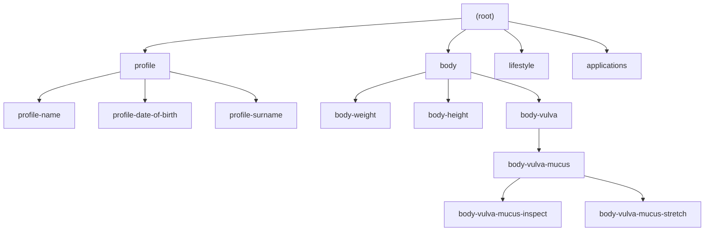

# HDS Model

The `HDSModel` loads the [HDS data model](https://github.com/healthdatasafe/data-model) and exposes it through lazy-loaded helper classes for items, streams, authorizations, event types, and datasources.

## Initialization

### Singleton pattern (recommended)

```javascript
const HDSLib = require('hds-lib');

// Optional: override service URL
HDSLib.settings.setServiceInfoURL('https://demo.datasafe.dev/reg/service/info');

// Initialize once at app startup
await HDSLib.initHDSModel();

// Use anywhere in your code
const model = HDSLib.getHDSModel();
```

`initHDSModel()` fetches the service info, extracts the model URL from assets, and loads the definitions. The model data is frozen (immutable) after loading.

### Manual loading

```javascript
const model = new HDSLib.HDSModel('https://model.datasafe.dev/pack.json');
await model.load();
```

### Properties

| Property | Type | Description |
|----------|------|-------------|
| `isLoaded` | `boolean` | Whether model data has been loaded |
| `modelData` | `object` | Raw model JSON (frozen) |
| `assets` | `object` | Service-info assets map (e.g., datasource URLs) |

---

## Items Definitions — `model.itemsDefs`

Items are the atomic data definitions in the HDS model (e.g., "body-weight", "profile-name").

### model.itemsDefs.getAll()

Returns all item definitions.

```javascript
const allItems = model.itemsDefs.getAll();
// Array of HDSItemDef instances
```

### model.itemsDefs.forKey(key)

Retrieve an item definition by its unique key.

```javascript
const weight = model.itemsDefs.forKey('body-weight');
weight.key;          // "body-weight"
weight.label;        // "Weight" (localized)
weight.description;  // Localized description
weight.eventTypes;   // ["mass/kg", "mass/lb"]
weight.repeatable;   // "unlimited"
weight.reminder;     // ReminderConfig or null
```

### model.itemsDefs.forEvent(event)

Find the item definition matching an event's streamId and type.

```javascript
const event = { streamIds: ['body-weight', 'dummy'], type: 'mass/kg' };
const itemDef = model.itemsDefs.forEvent(event);
itemDef.key; // "body-weight"
```

### HDSItemDef properties

| Property | Type | Description |
|----------|------|-------------|
| `key` | `string` | Unique identifier (e.g., `body-weight`) |
| `data` | `object` | Raw definition from model JSON |
| `label` | `string` | Localized display name |
| `description` | `string` | Localized description |
| `eventTypes` | `string[]` | Supported event types |
| `repeatable` | `string` | How many times item can be collected (default: `"unlimited"`) |
| `reminder` | `ReminderConfig \| null` | Reminder configuration |

### HDSItemDef.eventTemplate()

Returns a template for creating events for this item.

```javascript
const template = weight.eventTemplate();
// { streamIds: ['body-weight'], type: 'mass/kg' }
```

---

## Streams — `model.streams`

Streams are the hierarchical containers where events are stored. The HDS model defines a standard stream hierarchy.

### Stream hierarchy



*This is a simplified view. The actual hierarchy is defined by the loaded data model.*

### model.streams.getNecessaryListForItems(itemKeys, params?)

Get the list of streams that need to be created to store a set of items.

**Parameters:**
- `itemKeys` — Array of item key strings or `HDSItemDef` instances
- `params.nameProperty` — `'name'` (default), `'defaultName'`, or `'none'`
- `params.knowExistingStreamsIds` — Array of stream IDs known to already exist (will be skipped)

```javascript
const itemKeys = [
  'profile-name',
  'profile-date-of-birth',
  'body-vulva-mucus-stretch',
  'profile-surname'
];

const streams = model.streams.getNecessaryListForItems(itemKeys);
// Returns ordered list of streams to create:
// [
//   { id: 'profile', name: 'Profile', parentId: null },
//   { id: 'profile-name', name: 'Name', parentId: 'profile' },
//   { id: 'profile-date-of-birth', name: 'Date of Birth', parentId: 'profile' },
//   { id: 'profile-surname', name: 'Surname', parentId: 'profile' },
//   { id: 'body', name: 'Body', parentId: null },
//   { id: 'body-vulva', name: 'Vulva', parentId: 'body' },
//   { id: 'body-vulva-mucus', name: 'Mucus', parentId: 'body-vulva' },
//   { id: 'body-vulva-mucus-stretch', name: 'Stretch', parentId: 'body-vulva-mucus' }
// ]
```

With known existing streams:

```javascript
const streams = model.streams.getNecessaryListForItems(itemKeys, {
  knowExistingStreamsIds: ['profile']
});
// Skips creating 'profile' stream, still creates children
```

### model.streams.getDataById(streamId)

Retrieve the raw model definition for a stream.

```javascript
const data = model.streams.getDataById('body-weight');
```

### model.streams.getParentsIds(streamId)

Get ordered list of parent stream IDs from root to immediate parent.

```javascript
const parents = model.streams.getParentsIds('body-vulva-mucus-stretch');
// ['body', 'body-vulva', 'body-vulva-mucus']
```

---

## Authorizations — `model.authorizations`

Generate permission request sets from item keys. Computes the minimal set of stream permissions needed.

### model.authorizations.forItemKeys(itemKeys, options?)

**Options:**
- `defaultLevel` — Permission level: `'read'` (default), `'manage'`, `'contribute'`, `'writeOnly'`
- `includeDefaultName` — Add stream display names (default: `true`)
- `preRequest` — Pre-defined authorizations to include

```javascript
const itemKeys = [
  'body-vulva-mucus-inspect',
  'profile-name',
  'profile-date-of-birth',
  'body-vulva-mucus-stretch',
  'profile-surname'
];

const options = {
  preRequest: [
    { streamId: 'profile' },
    { streamId: 'app-test', defaultName: 'App test', level: 'write' }
  ]
};

const auths = model.authorizations.forItemKeys(itemKeys, options);
// [
//   { streamId: 'profile', defaultName: 'Profile', level: 'read' },
//   { streamId: 'app-test', defaultName: 'App test', level: 'write' },
//   { streamId: 'body-vulva-mucus-inspect', defaultName: 'Inspect', level: 'read' },
//   { streamId: 'body-vulva-mucus-stretch', defaultName: 'Stretch', level: 'read' }
// ]
```

**Optimization logic:**
- When a parent stream has `read` access, child streams with the same level are removed (parent covers them)
- Permission levels are ranked: `manage > contribute > read/writeOnly`
- `preRequest` items are merged with generated items

### AuthorizationRequestItem

```typescript
{
  streamId: string;
  level: string;       // 'read', 'manage', 'contribute', 'writeOnly'
  defaultName: string; // Localized stream display name
}
```

---

## Event Types — `model.eventTypes`

Access event type metadata from the model.

### model.eventTypes.getEventTypeDefinition(eventType)

```javascript
const def = model.eventTypes.getEventTypeDefinition('mass/kg');
```

### model.eventTypes.getEventTypeExtra(eventType)

```javascript
const extra = model.eventTypes.getEventTypeExtra('mass/kg');
```

### model.eventTypes.getEventTypeSymbol(eventType)

Returns the symbol/icon associated with an event type, or `null`.

```javascript
const symbol = model.eventTypes.getEventTypeSymbol('mass/kg');
```

---

## Datasources — `model.datasources`

External data sources defined in the model (e.g., medication databases).

### model.datasources.getAll()

```javascript
const all = model.datasources.getAll();
// Array of HDSDatasourceDef
```

### model.datasources.forKey(key)

```javascript
const medSource = model.datasources.forKey('medication');
```

### HDSDatasourceDef properties

| Property | Type | Description |
|----------|------|-------------|
| `key` | `string` | Datasource identifier |
| `label` | `string` | Localized label |
| `description` | `string` | Localized description |
| `endpoint` | `string` | Resolved URL (handles `assetKey://path` protocol) |
| `queryParam` | `string` | Query parameter name (e.g., `q`) |
| `minQueryLength` | `number` | Minimum query string length |
| `resultKey` | `string` | JSON path to results in API response |
| `displayFields` | `object` | `{ label, description }` — fields for display |
| `valueFields` | `string[]` | Fields to extract as values |

### Endpoint resolution

Datasource endpoints can use a special protocol that resolves through service-info assets:

```
"datasets://medication"
  → assets['datasets'] + '/medication'
  → "https://datasets.datasafe.dev/medication"
```

Direct HTTP URLs are used as-is.
