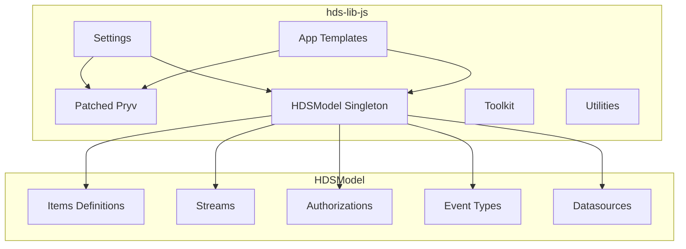
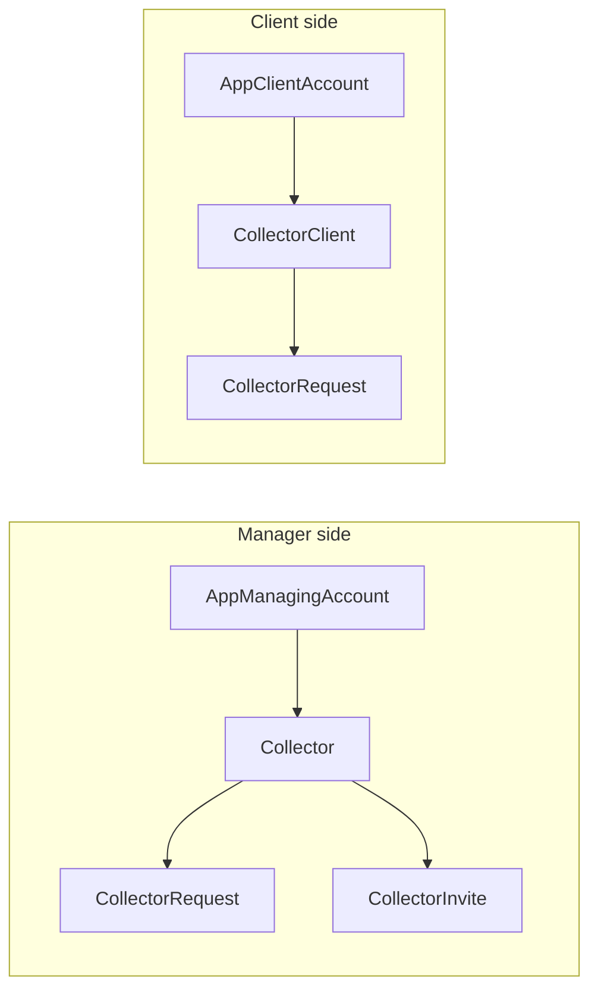

# HDS JavaScript Library

Generic toolkit for server and web applications built for the [Health Data Safe](https://github.com/healthdatasafe) ecosystem.

**Source:** [github.com/healthdatasafe/hds-lib-js](https://github.com/healthdatasafe/hds-lib-js)

---

## What it does

1. **Global settings** — Configure service endpoints and localization preferences
2. **Pryv extensions** — Extends the [Pryv JS library](https://github.com/pryv/lib-js) with Socket.io and Monitor support
3. **HDS Data Model** — Load and query the [HDS data model](https://github.com/healthdatasafe/data-model-draft) as a singleton: item definitions, streams, authorizations, event types, datasources
4. **App Templates** — Framework for building consent-based data collection and sharing applications (Manager, Collector, Invite, Client flows)
5. **Toolkit** — Helpers for stream auto-creation, reminders, duration parsing, and more

---

## Library exports

```javascript
const HDSLib = require('hds-lib');

HDSLib.settings            // Global configuration
HDSLib.pryv                // Patched Pryv library
HDSLib.HDSService          // Extended Pryv Service class
HDSLib.HDSModel            // Data model class
HDSLib.initHDSModel()      // Initialize model singleton (async)
HDSLib.getHDSModel()       // Retrieve model singleton
HDSLib.appTemplates        // Application template classes
HDSLib.localizeText(text)  // Localization function
HDSLib.l(text)             // Alias for localizeText
HDSLib.toolkit             // Stream helpers
HDSLib.logger              // Logging utilities
HDSLib.durationToSeconds() // ISO 8601 duration parser
HDSLib.durationToLabel()   // Seconds to human-readable label
HDSLib.computeReminders()  // Reminder status computation
```

---

## Documentation sections

| Section | Description |
|---------|-------------|
| [Getting Started](getting-started) | Installation, setup, browser and Node.js usage |
| [Settings](settings) | Service URL, locales configuration |
| [HDS Model](hds-model) | Data model singleton, items, streams, authorizations, event types, datasources |
| [App Templates](app-templates) | Consent workflows: Manager, Collector, Invite, Client |
| [Localization](localization) | Multi-language text handling |
| [Toolkit](toolkit) | Stream auto-creation, stream utilities |
| [Utilities](utilities) | Duration parsing, reminders, error handling, logging |

### Browser

- [Browser Test Suite]({{ site.baseurl }}/tests.html) (requires `backloop.dev`)

---

## Architecture overview

### Library modules



### App Templates classes


